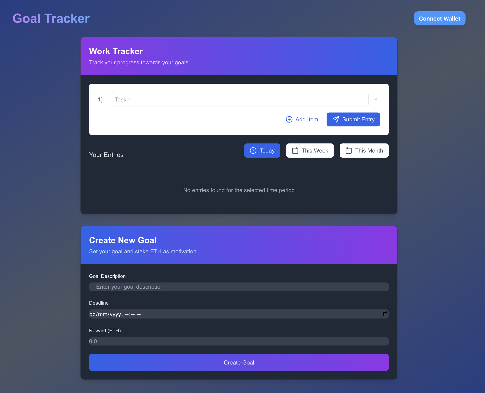

# 📝 Milestone Tracker

A blockchain-powered work tracking application that combines daily task management with smart contract goals. Set tasks, track your progress, and earn rewards for completing your goals!



## ⚡ Features

- 📋 Daily task tracking with numbered entries
- ⛓️ Blockchain-powered goal setting
- 💰 Stake ETH as motivation for completing goals
- 🎯 Smart contract reward system
- 📅 Filter tasks by day, week, or month
- 🌈 Web3 wallet integration

## 🛠️ Tech Stack

[](https://skillicons.dev)

- Next.js with TypeScript
- Solidity for Smart Contracts
- Hardhat for Ethereum development
- RainbowKit & wagmi for wallet integration
- Tailwind CSS for styling
- Sepolia Testnet deployment

## 🚀 Getting Started

### Environment Variables

Create a `.env` file in the root directory:

```env
ALCHEMY_API_KEY=your_ALCHEMY_API_KEY
PRIVATE_KEY=your_wallet_private_key
ETHERSCAN_API_KEY=your_etherscan_key
NEXT_PUBLIC_WALLETCONNECT_PROJECT_ID=your_walletconnect_project_id
```

### Installation

1. Clone the repository
```bash
git clone https://github.com/AtharvaD-coder/Milestone-Tracker.git
```

2. Install dependencies
```bash
npm install
```

3. Compile smart contracts
```bash
cd backend

npx hardhat compile
```

4. Deploy smart contracts to Sepolia
```bash
npx hardhat run scripts/deploy.ts --network sepolia
```

5. Update the contract address and ABI
- Copy the deployed contract address and ABI
- Update `app/contractABI.ts` with the new ABI and `app/components/GoalForm.tsx` with the new address

### Running Locally

1. Start the development server
```bash
npm run dev
```

2. Open [http://localhost:3000](http://localhost:3000) in your browser

3. Connect your wallet (make sure it's on Sepolia network)

## 📱 Usage

1. **Connect Wallet**: Click the "Connect Wallet" button to connect your Web3 wallet
2. **Daily Tasks**: Add your daily tasks using the numbered input system
3. **Smart Contract Goals**: 
   - Set a goal with a deadline
   - Stake some ETH as motivation
   - Mark goals as complete
   - Claim your rewards when done
4. **Filter View**: Toggle between daily, weekly, and monthly views